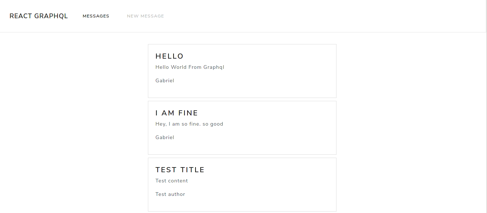
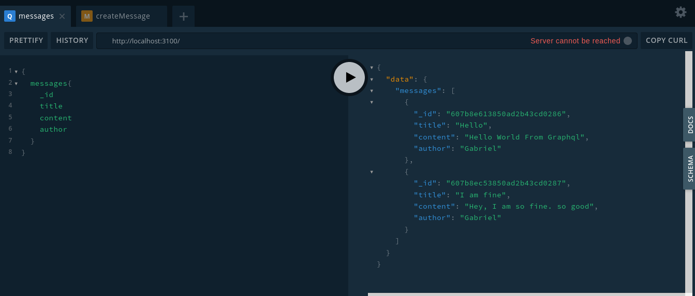
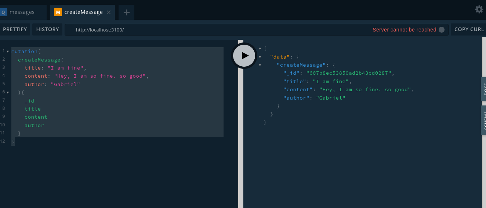

# GRAPHQL AND REACT APP :rocket:

This app connect a frontend app with a graphql api.

## Technologies used for this project :computer:

-  [graphql](https://graphql.org)
-  [nodejs](https://nodejs.org/en/)
-  [mongodb](https://nodejs.org/en/)

## Screenshots :camera:





## Hacking

> The database (mongo) must be have running at port 27017 (default port)

```cmd
git clone
cd
npm install
npm run build
npm start
```

> Ready, happy hacking :D
